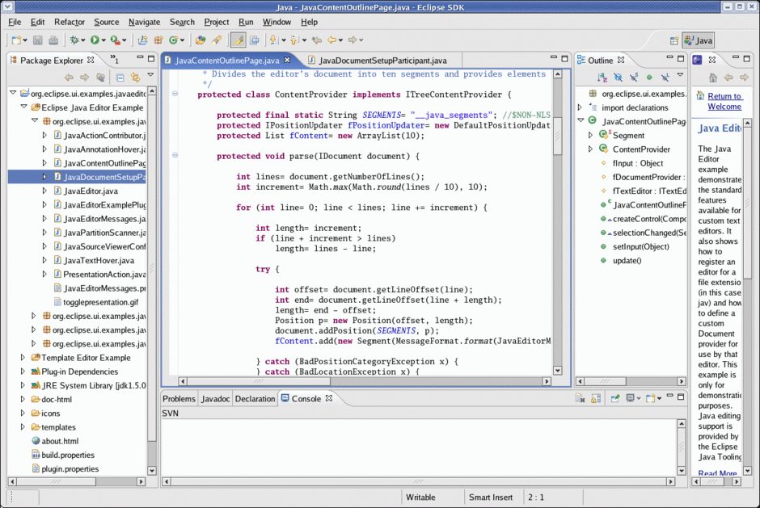

!SLIDE bullets incremental transition=scrollHorz
# Wut? #

* Intergrated Development Environment

!SLIDE full- transition=scrollHorz

!SLIDE bullets incremental transition=scrollHorz
# Je desktop is een IDE #
* [UNIX is een IDE](http://blog.sanctum.geek.nz/unix-as-ide-introduction/).
* Goede, geïntegreerde desktop is een IDE.
