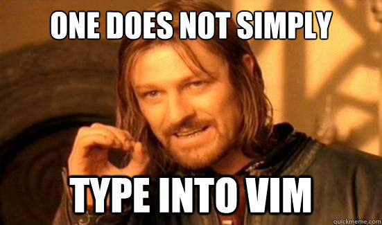
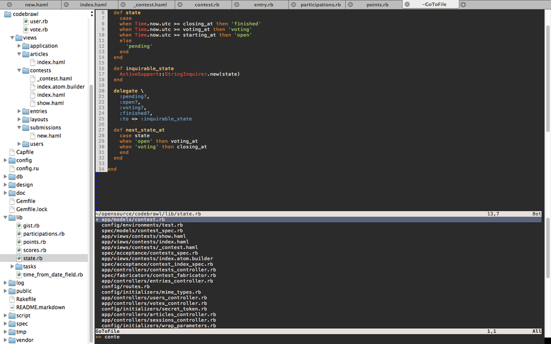

!SLIDE full-page transition=scrollHorz

!SLIDE bullets incremental transition=scrollHorz
# Leercurve #
* Steil.
* De eerste dagen/weken/maanden werk je op halve kracht.
* Niet.
!SLIDE bullets incremental transition=scrollHorz

# Tips #
* Gebruik macvim of gvim. Muis werkt gewoon.
* Overweeg een "Distro":
  * Janus.
  * Vim-PHP-IDE,

!SLIDE full-page transition=scrollHorz

!SLIDE bullets incremental transition=scrollHorz
# Distro #
* Is complex.
* Gaat kapot.
* Moet weggevaagd.
