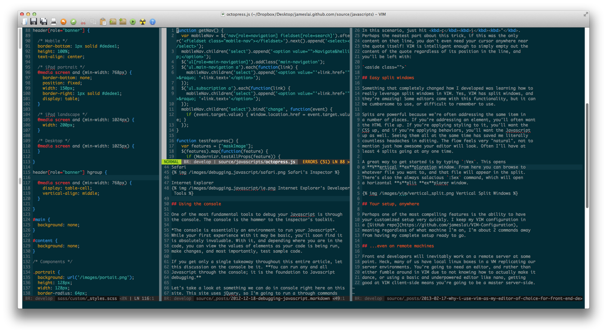
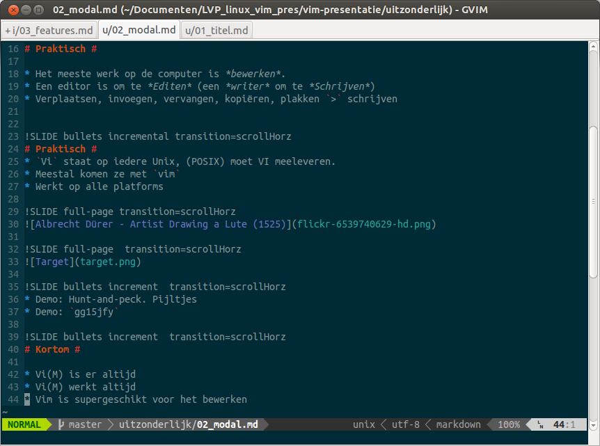

!SLIDE bullets incremental transition=scrollHorz
# Out of the Box #
* Syntax highlighting
* Ftype settings

!SLIDE bullets incremental transition=scrollHorz
* Tags-support
* **DEMO**

!SLIDE bullets incremental transition=scrollHorz
* Editen over ssh/ftp etc met `:help netrw`
* **DEMO**

!SLIDE bullets incremental transition=scrollHorz
* grep, zoeken, reguliere expressies
* macro's
* **DEMO**

!SLIDE bullets incremental transition=scrollHorz
* Split windows

!SLIDE bullets incremental transition=scrollHorz

!SLIDE bullets incremental transition=scrollHorz
* Spellcheck
* veel, veel, veel meer
