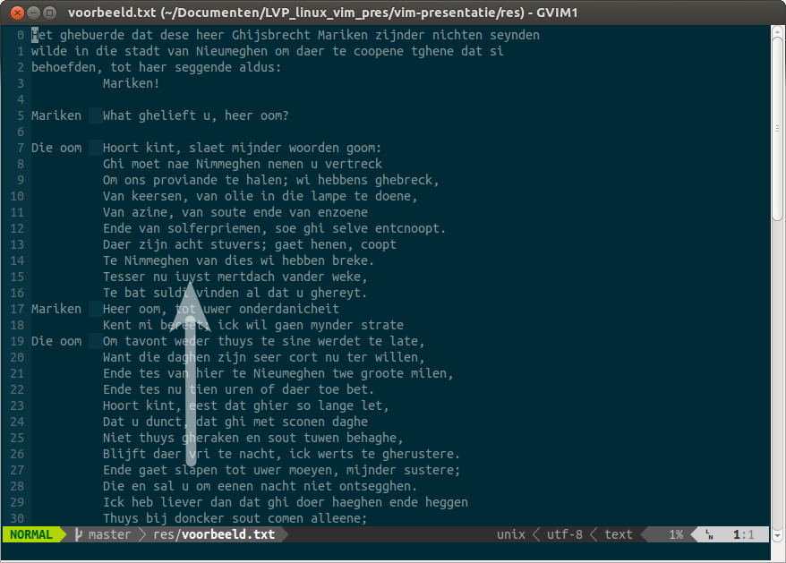

!SLIDE bullets incremental transition=scrollHorz
# Modal #

* Normal mode (Command mode) `<Esc>`
* Insert mode (Typing text) `i a o etc.`
* Last-line mode `:<command>`

!SLIDE transition=scrollHorz
# Rationale #

> Most time is spent reading, checking for errors and looking for the right place to work on, rather than inserting new text or changing it. Navigating through the text is done very often, thus you should learn how to do that quickly.

   - [Bram Moolenaar www.moolenaar.net/habits.html](http://www.moolenaar.net/habits.html)

!SLIDE bullets incremental transition=scrollHorz
# Praktisch #

* Het meeste werk op de computer is *bewerken*.
* Een editor is om te *Editen* (een *writer* om te *Schrijven*)
* Verplaatsen, invoegen, vervangen, kopiëren, plakken `>` schrijven

!SLIDE bullets incremental transition=scrollHorz
# Praktisch #
* `Vi` staat op iedere Unix, (POSIX) moet VI meeleveren.
* Meestal komen ze met `vim`
* Werkt op alle platforms

!SLIDE full-page transition=scrollHorz

!SLIDE full-page  transition=scrollHorz

!SLIDE bullets increment  transition=scrollHorz
* Demo: Hunt-and-peck. Pijltjes
* Demo: `gg15jfy`

!SLIDE bullets increment  transition=scrollHorz
# Kortom #

* Vi(M) is er altijd
* Vi(M) werkt altijd
* Vim is supergeschikt voor het bewerken
